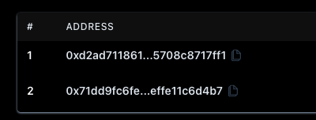
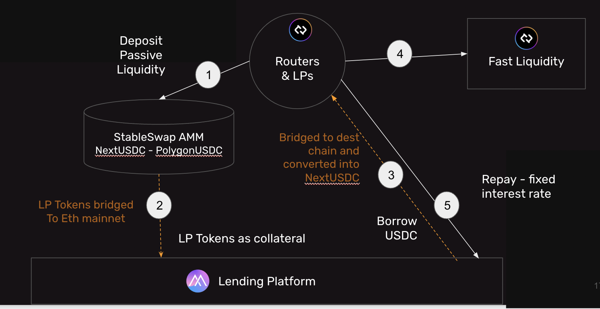

# Providing Liquidity

### How it works

At a high level, routers provide active liquidity with local NextAssets on each destination chain and receive **5bps**/transfer as a fee.

From a router perspective, you can just just monitor your funds and APY.  

Where necessary, for end users Connext will swap into and out of local and adopted assets through our AMMs. Below is the most complex version of this, where both chains have local≠adopted.

### How can I add active liquidity to Amarok-v2?

<aside>
💡 Note: At launch routers will be allowlisted, please reach out if you are interested or have questions!  The allowlist is temporary during our initial Beta phase.

</aside>

Using UDSC as an example, to provide active liquidity on Amarok you will need to get local nextUSDC on the desired chain. 

**Instructions below:**

1. Move USDC to Ethereum mainnet
    1. [If moving funds from nxtp-v1] Remove desired amount of USDC from chain on nxtp-v1 with [remove-liquidity endpoint](https://github.com/connext/nxtp/blob/1fc5f3d47e146f67957f8a6943cc8888cb392936/packages/router/example.http#L12-L22). **
        1. (Note: If removing ALL funds from v1 router, add `"cleanupMode":"true"` and wait until amount f locked tokens equals 0. We phasing this out and and will closely communicate) 
2. Bridge USDC to the desired chain through Connext, specifying to ‘Receive local’  in the Bridge UI settings to receive nextUSDC and avoid swaps/slippage.
    
    
    
    *Will say ‘Receive Local’
    
3. Navigate to the ‘Router’ tab on Connextscan 2.0 and click your router ID
    
    
    
4. Click ‘Manage Router, and add funds using our new ‘Add liquidity’ UI feature

### (Coming soon) How to increase yield with dual passive/active liquidity

Connext is partnering with [Themis](https://twitter.com/ThemisProtocol), a Defi lending protocol, to allow you to provide passive liquidity, borrow against your LP tokens, and use loaned funds as active liquidity.

This will increase your yield and improve capital efficiency. We expect users will further be able to receive liquidity incentives from Themis on top.

Borrowing will have a fixed low interest rate to enable easier calculation of net returns.

We will confirm when we have a readiness date!